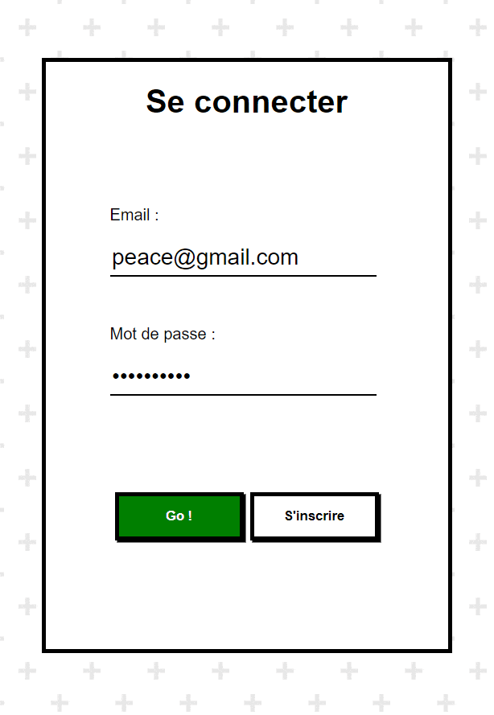

# Kryfos :lock:

<p align="center">
  
</p>

Production ready[^1] chat made with [Node.js](https://nodejs.org/en/) ([Express](https://expressjs.com/)), [MongoDB](https://www.mongodb.com/) ([Mongoose](https://mongoosejs.com/)) and [WebSocket](https://developer.mozilla.org/en-US/docs/Glossary/WebSockets).

Kryfos uses the [Mongoose ODM](https://mongoosejs.com/) to connect to a [MongoDB Atlas](https://www.mongodb.com/atlas) [cloud database](https://www.ibm.com/cloud/learn/what-is-cloud-database) deployed on [AWS](https://aws.amazon.com/), and [EJS](https://ejs.co/) as a template engine (for [Server-Side Rendering](https://ageek.dev/server-side-rendering)). [WebSocket exchanges are handled natively on the front end](https://github.com/pathei-kosmos/kryfos/blob/master/public/scripts/wsClient.js), not by using a third party library like [socket.io](https://socket.io/), [for better performance](https://stackoverflow.com/a/38558531). On the back end, Kryfos uses [express-ws](https://github.com/HenningM/express-ws). The user can create an account, log in, send and receive messages in the main room.

Kryfos uses [morgan](https://www.npmjs.com/package/morgan) for its logs, [compresses its HTTP responses](https://en.wikipedia.org/wiki/HTTP_compression) in [gzip](https://en.wikipedia.org/wiki/Gzip) and secures their [headers](https://developer.mozilla.org/en-US/docs/Web/HTTP/Headers) with [helmet](https://helmetjs.github.io/). Authentication is done by [sessions](https://github.com/expressjs/session) saved in a [secure memory store](https://github.com/roccomuso/memorystore) based on [lru-cache](https://github.com/isaacs/node-lru-cache).

The application hashes its passwords with [bcrypt](https://en.wikipedia.org/wiki/Bcrypt), protects itself against [HTTP Parameter Pollution attacks](https://owasp.org/www-project-web-security-testing-guide/latest/4-Web_Application_Security_Testing/07-Input_Validation_Testing/04-Testing_for_HTTP_Parameter_Pollution) with [hpp](https://www.npmjs.com/package/hpp), [XSS attacks](https://owasp.org/www-community/attacks/xss/) by never using [innerHTML](https://developer.mozilla.org/en-US/docs/Web/API/Element/innerHTML), and [NoSQL injections](https://owasp.org/www-pdf-archive/GOD16-NOSQL.pdf) with the Mongoose `sanitizeFilter()` flag ([which I added to the Mongoose documentation during this project](https://github.com/Automattic/mongoose/pull/12112)). All user inputs are validated and sanitized with [express-validator](https://github.com/express-validator/express-validator) and Kryfos even supports [HTML entites](https://github.com/mdevils/html-entities). [Custom security rules](https://github.com/pathei-kosmos/kryfos/blob/master/app.js#L308) have been added on WebSocket exchanges to allow only connections from the chat.



## Requirements

* Node 
* Git
* CLI

## Setup

Clone the repo and install the dependencies.

```bash
git clone https://github.com/pathei-kosmos/kryfos
cd kryfos
```

```bash
npm install
```

Note that for obvious security reasons the environment variables are not provided. You will have to create a file `".env"` at the root of the project with this content: 

```
SECRET_KEY_SESSION = "your security key for sessions, a random sequence of 32 characters and numbers"
PORT = the port of your choice on which the server will run
DBURI = "the connection link to your MongoDB Atlas database"
DOMAIN = "localhost"
```

Launch the live server:
```bash
npm run start
```

[^1]: The chat has already been successfully deployed online on Heroku.